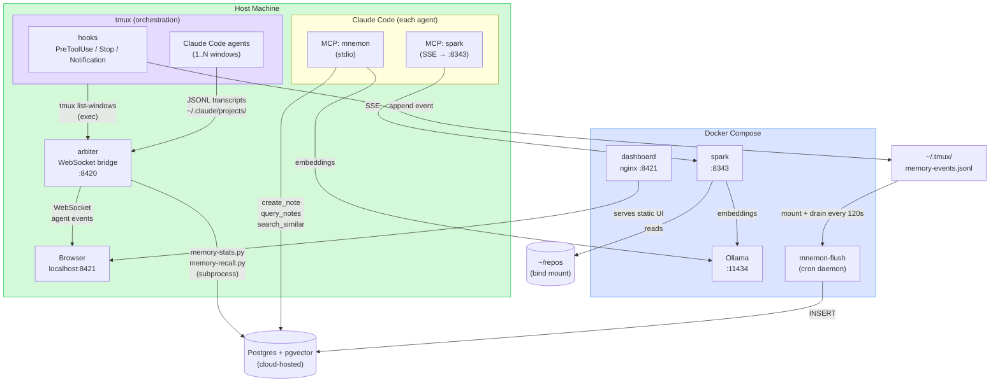

# agents-nexus

RTS-inspired multi-agent orchestration with a built-in knowledge stack. Run multiple Claude Code agents across repos simultaneously, persist memory across sessions, and semantically search your codebase — all from tmux.

Multi-platform: macOS, Windows (MSYS2), Linux.

## What's Inside

| Component | What it does |
|-----------|-------------|
| **tmux layer** | Orchestration shell — spawn agents, monitor status, relay commands without context switches |
| **arbiter** | WebSocket bridge — streams live tmux + transcript state to the dashboard |
| **dashboard** | Pixel art office visualization of all active agents |
| **mnemon** | Agent memory — persist notes and events to Postgres, query via MCP in any session |
| **spark** | Semantic search index over all your repos, served as an MCP tool |
| **Langfuse** | Optional observability stack — traces every memory operation (start with `task langfuse:up`) |

## Architecture



## Knowledge Stack (Docker)

Ollama, Spark, the mnemon flush daemon, and the pixel dashboard all run as Docker services. **Postgres is cloud-hosted** — point `DATABASE_URL` at your cloud instance. The arbiter and mnemon MCP server run natively (arbiter needs the local tmux socket; mnemon is stdio-based).

### Prerequisites

- [Docker Desktop](https://www.docker.com/products/docker-desktop/) — enable **Start at login** in settings
- [`task`](https://taskfile.dev) — `brew install go-task`
- A Postgres instance with pgvector (cloud or local — DigitalOcean managed postgres works well)

### First-time setup

```bash
cd ~/repos/agents-nexus

# 1. Create your local env file
cp .env.example .env

# 2. Fill in secrets — key fields:
#    DATABASE_URL  — connection string to your cloud Postgres
#    GITLAB_TOKEN  — GitLab personal access token (for repo metadata)
#    REPOS_PATH    — absolute path to your repos directory (no ~ expansion)
#    HOST_TMUX_DIR — usually ~/.tmux
$EDITOR .env

# 3. Run database migrations
task mnemon:migrate

# 4. Start Docker services (ollama, spark, mnemon-flush, dashboard)
task docker:up

# 5. Pull the embedding model into Ollama (once; ~270 MB)
task docker:init

# 6. Start native services (arbiter + mnemon MCP) in the background
task up

# 7. Build the Spark index (first run indexes all repos — takes a while)
task spark:reclaim

# 8. Wire autostart so the stack comes up after every reboot
task launchd:install
```

### Point Claude Code at the local services

Add mnemon and spark to `~/.claude.json`:

```json
{
  "mcpServers": {
    "agent-memory": {
      "type": "stdio",
      "command": "/path/to/agents-nexus/mnemon/.venv/bin/python3",
      "args": ["-m", "agent_memory.server.mcp_server"]
    },
    "spark": {
      "type": "sse",
      "url": "http://localhost:8343/sse"
    }
  }
}
```

### Stack lifecycle

```bash
task up                     # start docker stack + arbiter + mnemon in background
task kill                   # stop arbiter and mnemon
task restart                # kill + up
task logs                   # tail arbiter and mnemon logs

task docker:up              # start docker services only
task docker:down            # stop docker services (volumes preserved)
task docker:logs            # tail all docker logs
task docker:logs -- spark   # tail a single service
task docker:status          # health + uptime

task spark:activate -- my-repo   # re-index one repo after changes
task spark:reclaim               # full index rebuild
task spark:status                # index stats

task launchd:install        # enable autostart on login (macOS)
task launchd:uninstall      # disable autostart
```

### Langfuse (optional observability)

Langfuse is bundled as an optional Docker Compose profile. It traces every mnemon memory operation (L2/L3 reads, retrieval scoring, archive jobs, entity extraction LLM calls).

```bash
task langfuse:up        # start Langfuse stack (postgres, redis, clickhouse, minio, web, worker)
task langfuse:down      # stop (data volumes preserved)
task langfuse:update    # pull latest images and restart
task langfuse:logs      # tail web + worker logs
task langfuse:status    # container health
```

After `task langfuse:up`, open `http://localhost:3000`, create an account, then generate an API key and add it to `.env`:

```
LANGFUSE_HOST=http://localhost:3000
LANGFUSE_PUBLIC_KEY=pk-lf-...
LANGFUSE_SECRET_KEY=sk-lf-...
```

> **Plain `task up` / `docker compose up -d` will not start Langfuse.** The profile is self-documenting — it's in the compose file so you know it exists, but it stays off unless you explicitly opt in.

### Ports

| Service | Port | Notes |
|---------|------|-------|
| Ollama | 11434 | Embedding model |
| Spark | 8343 | Semantic search MCP (SSE) |
| Dashboard UI | 8421 | Pixel office UI (nginx) |
| Arbiter | 8420 | WebSocket bridge (native) |
| Langfuse | 3000 | Observability UI (optional) |

---

## Tmux Integration

### Install

One command — detects your OS, installs system deps, links configs, and sets up the pixel dashboard:

```bash
cd ~/repos/agents-nexus
./install.sh            # full install (deps + configs + dashboard)
./install.sh --no-ui    # skip pixel dashboard setup
```

The installer handles macOS (Homebrew), Windows (MSYS2/pacman), and Linux (apt/dnf/pacman).

> **Windows:** Requires [MSYS2](https://www.msys2.org/) (default: `C:\msys64`). Run inside an MSYS2 terminal.
> MSYS2's `$HOME` is `/home/<user>` (`C:\msys64\home\<user>`), not `/c/Users/<user>`.

[Claude Code](https://docs.anthropic.com/en/docs/claude-code) must be installed and on `PATH`.

Set `AGENTS_NEXUS_DIR` in `~/.tmux/env.sh` if you install outside the default `~/repos/agents-nexus`:

```bash
AGENTS_NEXUS_DIR="/your/custom/path/agents-nexus"
```

### Start a session

```bash
work            # attach/create "agents" session
work query      # attach/create "query" session
```

### Spawn agents

| Hotkey | Action |
|---|---|
| `ctrl+a → N` | Fuzzy repo picker → opens claude in new background window |
| `ctrl+a → n` | Prompt for path → opens claude there |

### Monitor agents

| Command / Hotkey | Action |
|---|---|
| `v 2` | Quick peek at agent 2 (status summary + last output) |
| `ctrl+a → A` | APM dashboard popup |
| `agents` | List all registered agents with slot, name, and directory |
| Status bar | Grey = idle, Green = running, Yellow = stuck (>10min), Red = needs input |

### Send commands without switching

```bash
q 2 use JWT                       # queue message to agent 2
q 2 "can you check the tests?"   # quote if message has ? ! * etc.
q 2 1                             # approve (no Enter — instant select)
```

### API key rotation

Multiple named keys can be stored in `~/.tmux/keys/` and swapped per session. New agent windows spawned after a swap inherit the active key automatically.

```bash
# One-time setup
mkdir -p ~/.tmux/keys
echo 'sk-ant-...' > ~/.tmux/keys/alex
echo 'sk-ant-...' > ~/.tmux/keys/buddy
chmod 600 ~/.tmux/keys/*

# Swap keys
usekey buddy     # activate buddy's key for this session
usekey alex      # swap back
whichkey         # show active key name + first 12 chars
keys             # list all profiles (* = active)
```

The status bar shows `[key:name]` in red when a non-default key is active. Hidden when you're on your own key.

> Keys live in `~/.tmux/keys/` — never committed to the repo.

### Agent-to-agent messaging

Agents automatically know about each other. On startup, each agent:

1. **Registers** itself in `~/.tmux/registry/` (keyed by pane ID)
2. **Receives a peer list** in its opening prompt — slot number, project name, and directory for every other active agent

Agents can use `/msg <slot> <message>` without you telling them which slot to target. The `agents` shell command shows the same registry for humans.

### Navigation

| Hotkey | Action |
|---|---|
| `ctrl+a → 1..9` | Jump to window N |
| `ctrl+a → w` | Window list with live preview |
| `ctrl+a → s` | Session tree |
| `ctrl+a → \|` | Split pane horizontal |
| `ctrl+a → -` | Split pane vertical |
| `ctrl+a → d` | Detach (leave running in background) |
| `ctrl+a → r` | Reload tmux config |
| `ctrl+a → ,` | Rename current window |

---

## APM Tracking

The status bar shows a rolling 60-second count: `42a/7h` = 42 agent actions, 7 human actions.

`ctrl+a → A` opens the full dashboard with today's totals, avg response time, and active agent count.

### What gets tracked

| Event | Logged as |
|---|---|
| Agent tool use | `agent` |
| Agent waiting for input | `wait` |
| `q` command sent | `human-q` |
| `v` peek | `human-v` |
| Window switch | `switch` |
| Fuzzy picker / new window / splits | `tmux-*` |

Log lives at `~/.tmux/apm.log`, auto-pruned to 24h.

---

## Claude Code Hooks

The `claude-settings.json` configures two hooks:

- **Stop** — sets `@waiting` flag (turns status bar red), fires bell, logs `wait`
- **PreToolUse** — clears `@waiting` flag, logs `agent` tool use

---

## Files

```
agents-nexus/
├── install.sh               # unified installer (detects OS)
├── Taskfile.yml             # task runner (docker, spark, mnemon, arbiter, launchd)
├── docker-compose.yml       # knowledge stack (ollama, spark, mnemon-flush, dashboard) + optional Langfuse profile
├── .env.example             # environment variable template
├── CLAUDE.md.template       # scaffold template for per-repo CLAUDE.md
├── IDEAS.md                 # roadmap & feature ideas
├── arbiter/                 # WebSocket bridge (tmux state → dashboard)
├── dashboard/               # pixel art office UI (React + Vite)
├── mnemon/                  # agent memory system (MCP server + Postgres)
│   └── migrations/          # database schema
├── spark/                   # semantic repo search index (MCP server)
├── docker/                  # Dockerfiles + postgres init SQL
├── launchd/                 # macOS autostart plists
└── tmux/
    ├── mac/                 # macOS tmux config, hooks, install script
    ├── windows/             # Windows (MSYS2) equivalent
    └── linux/               # Linux (placeholder)
```

---

## Platform differences

| | macOS | Windows (MSYS2) | Linux |
|---|---|---|---|
| Shell | zsh | bash | bash |
| Home | `~/` | `/home/<user>` (MSYS2) | `~/` |
| `date` | BSD (`-v0H`) | GNU (`-d "today..."`) | GNU |
| `read` key | `-rk1` (zsh) | `-rsn1` (bash) | `-rsn1` |
| Notifications | `osascript` | PowerShell toast | `notify-send` |
