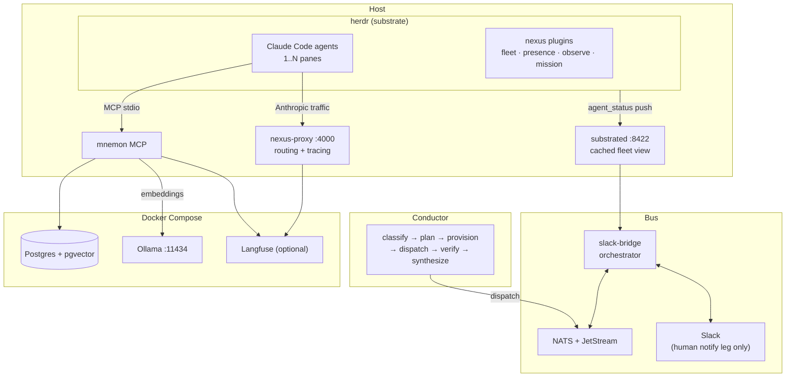

# agents-nexus

Batteries-included toolkit for running **fleets of AI coding agents** on the
[herdr](https://herdr.dev) multiplexer. Spawn Claude Code agents across many repos at once,
give them memory that survives the session, drive them from Slack, and dispatch autonomous
multi-repo missions — from one terminal.

Everything past the multiplexer is **opt-in and degrades gracefully**: no Postgres, no
Docker, no Slack workspace? The fleet notices and skips those paths.

Linux and macOS. (tmux is supported as a fallback substrate; a historical Windows/MSYS2 path
exists but is no longer maintained.)

## Quick start

**Just trying it?** → [`QUICKSTART.md`](QUICKSTART.md) — a driveable fleet in ~5 minutes, knowledge
stack left off. Start there.

**Full setup:**

```bash
git clone <this-repo> && cd agents-nexus
./install.sh                  # deps (incl. herdr), profile, .env, plugin picker, optional stack
./install.sh --profile work   # or jump straight to a named profile
```

[`INSTALL.md`](INSTALL.md) is the complete installer reference — every flag, every prompt, every
file it writes. Use-case gotchas live in [`README_SETUP_PERSONAL.md`](README_SETUP_PERSONAL.md)
and [`README_SETUP_WORK.md`](README_SETUP_WORK.md).

If you install outside the default `~/repos/agents-nexus`, set `AGENTS_NEXUS_DIR` in
`~/.tmux/env.sh`:

```bash
AGENTS_NEXUS_DIR="/your/custom/path/agents-nexus"
```

[Claude Code](https://docs.anthropic.com/en/docs/claude-code) must be installed and on `PATH`.

## What's inside

| Component | What it does |
|---|---|
| **herdr** | The substrate. Spawns agents into panes, tracks `working`/`blocked`/`idle`, pushes status transitions over a local socket. Default backend; tmux still supported via `NEXUS_SUBSTRATE=tmux`. |
| **`substrated`** | Read-path daemon (`:8422`). Holds a cached fleet view and serves it over a tiny HTTP API so hot readers don't spawn a subprocess per read. Subscribes to herdr status **pushes**, so the idle-gate fires the instant an agent goes idle. |
| **plugins** | Four herdr plugins — Fleet, Presence, Observe, Mission — offered as a multi-select after base install. See [Plugins](#plugins). |
| **mnemon** | Agent memory. Layered store (L2 tuplespace → L3 knowledge graph), weighted retrieval, entity extraction, salience decay. Exposed to every agent over MCP. See [mnemon](#mnemon). |
| **slack-bridge** | Agent-to-agent bus and human control plane. Orchestrator + presence + delivery over **NATS/JetStream**; spawn, message, and approve agents from Slack. |
| **Conductor** (`agent-runner/`) | Mission orchestrator — turns a task into a *verified* result. Deterministic spine, scoped LLM judgment nodes, verification loop. See [Conductor missions](#conductor-missions). |
| **`proxy`** | Transparent Anthropic pass-through (`:4000`) with per-session upstream routing (work vs. personal) and Langfuse tracing on every `/v1/messages` call. |
| **Langfuse** | Optional observability stack. Traces memory ops (L2/L3 reads, retrieval scoring, archive jobs, entity extraction) and proxy generations. |
| **overlays** | Layer org- or machine-specific config over a generic checkout at install time, without committing it. |

## Architecture


```mermaid
graph TB
  subgraph host["Host"]
    subgraph herdr["herdr (substrate)"]
      agents["Claude Code agents<br/>1..N panes"]
      plugins["nexus plugins<br/>fleet · presence · observe · mission"]
    end
    substrated["substrated :8422<br/>cached fleet view"]
    proxy_svc["nexus-proxy :4000<br/>routing + tracing"]
    agents -->|"MCP stdio"| mnemon_mcp["mnemon MCP"]
    agents -->|"Anthropic traffic"| proxy_svc
    herdr -->|"agent_status push"| substrated
  end

  subgraph bus["Bus"]
    nats["NATS + JetStream"]
    bridge["slack-bridge<br/>orchestrator"]
    slack["Slack<br/>(human notify leg only)"]
    substrated --> bridge
    bridge <--> nats
    bridge <--> slack
  end

  subgraph conductor["Conductor"]
    mission["classify → plan → provision<br/>→ dispatch → verify → synthesize"]
    mission -->|"dispatch"| nats
  end

  subgraph docker["Docker Compose"]
    pg[("Postgres + pgvector")]
    ollama["Ollama :11434"]
    lf["Langfuse (optional)"]
  end

  mnemon_mcp --> pg
  mnemon_mcp -->|"embeddings"| ollama
  proxy_svc --> lf
  mnemon_mcp --> lf
```

## Plugins

herdr plugins are the fleet's UX layer. The base install deploys a **plugin-free** config;
the installer then offers a multi-select from [`plugins/catalog.toml`](plugins/catalog.toml).

| Plugin | Default | What it gives you |
|---|:---:|---|
| **`nexus.fleet`** | on | `prefix+shift+n` fuzzy repo/worktree picker → spawns a context-injected agent. `prefix+shift+b` creates a workspace bucket. |
| **`nexus.presence`** | on | Desktop toast when an agent goes `blocked` and is *still* blocked after a settle window, so prompts the classifier auto-approves don't ping. Pure event hook — no keybinding, no daemon, no polling. **Redundant if you run `~/.tmux/hook-notification.sh`**, which already sends a classifier-gated desktop toast — disable presence there. |
| **`nexus.observe`** | on | Split-alongside dashboards: memory health (`shift+m`), fleet APM (`shift+a`), note search (`shift+f`), command center (`shift+o`). Degrades to a status view when the memory DB is unreachable. |
| **`nexus.mission`** | off | Launch Conductor missions from a chord (`ctrl+a shift+p`). Heavier deps — opt-in. |

```bash
bash scripts/plugin-install-flow.sh              # re-run the picker
scripts/herdr-plugin-install.sh nexus-observe    # add one directly
herdr plugin list                                # what's enabled
```

## mnemon

Durable memory for agents, in Postgres, reachable from any session over MCP. Named after the
memory implants in Iain M. Banks' *Culture* novels.

It is **layered, not a flat vector pile**:

- **L2 — tuplespace.** A shared working cache using Linda coordination primitives. Agents on the
  same mission read and write facts here without talking to each other directly.
- **L3 — knowledge graph.** On job completion the archiver promotes L2 facts into durable nodes,
  extracting entities (file paths, `[[wikilinks]]`, `@mentions`) and wiring backlinks.
- **Retrieval** is MAGMA-style weighted scoring — semantic similarity, tag overlap, recency, and
  access frequency — not similarity alone.
- **Decay** reduces salience of stale, unaccessed nodes. High-access nodes resist it: a node
  survives unless `access_count < log2(age_days)`.
- **Context building** renders L3 knowledge as Obsidian-style markdown, token-budgeted, for
  injection at spawn.

MCP tools: `log_event`, `create_note`, `query_notes`, `search_similar`, `query_entity`,
`recent_events`, `query_session`.

Embeddings are local — Ollama `nomic-embed-text`, 768-dim. No external embedding API.

Full detail in [`mnemon/README.md`](mnemon/README.md). Register it with Claude Code
(`~/.claude.json`):

```json
{
  "mcpServers": {
    "agent-memory": {
      "type": "stdio",
      "command": "/path/to/agents-nexus/mnemon/.venv/bin/python3",
      "args": ["-m", "agent_memory.server.mcp_server"]
    }
  }
}
```

## Conductor missions

The Conductor turns a *task* into a *verified result*: a deterministic spine (routing,
provisioning, dispatch, state, I/O) with a few scoped judgment nodes that emit typed output
the spine acts on. The spine never asks an LLM "what next?" open-endedly.

- **`--distribute "<goal>"`** — fan-out mission: classify → plan → provision worktrees →
  dispatch workers into a tiled `mission/<slug>` bucket → verify → adjudicate → synthesize →
  report. Runs detached.
- **`--sdlc "<ticket|goal>"`** — drives a staged pipeline (requirements → domain model →
  tech design → validation → `plan.md`) and stops at the plan. Code is left to a human.

Verification is non-negotiable — a mission cannot report done until verify passes, and failed
verification feeds findings back into re-dispatch rather than into a dead end. Small
single-repo work takes the one-shot escape hatch (worker + verify) and skips the coordination tax.

Design notes: [`docs/conductor-design.md`](docs/conductor-design.md).

## The proxy

`nexus-proxy` (`:4000`) sits between Claude Code and Anthropic, forwards requests verbatim, and
logs every `/v1/messages` call to Langfuse. It routes per session: sessions tagged `work-<repo>`
go to the work gateway, everything else goes straight to Anthropic. **Personal traffic never
touches the work gateway** — no corp-auth injection, no attribution, no dependency on that
gateway being up — while both still get tracing.

Routing and resilience design: [`docs/model-routing.md`](docs/model-routing.md).

## Overlays

Anything org-, machine-, or person-specific stays out of this repo and layers in at install time:

```bash
./install.sh --overlay <your-overlay-repo-url>
```

Overlays compose — run it once per overlay, each declaring its own `name` in `overlay.toml`.
`scripts/overlay-apply.sh --status` lists what's applied, `--remove <name>` un-applies one.
Without `--overlay` you get a generic standalone setup. See
[`overlay.example/README.md`](overlay.example/README.md) and [`MAINTAINERS.md`](MAINTAINERS.md).

## The knowledge stack

Postgres (+pgvector), Ollama, and the mnemon flush daemon run as Docker services; the mnemon MCP
server runs natively (stdio). Postgres is bundled locally by default — point `DATABASE_URL` at a
managed instance and skip the `postgres` profile to bring your own.

**Prerequisites:** Docker, [`task`](https://taskfile.dev), Postgres with pgvector (bundled).

```bash
./install.sh --profile personal   # deps, profile, .env, optional stack start
task mnemon:migrate               # migrations
task docker:init                  # pull the embedding model (~270 MB, once)
task up                           # start native services in the background
```

If you skipped the "start the stack now?" prompt, run `task docker:up` before the migrations.
Switch profiles later with `./install.sh --switch <name>`; paste Langfuse keys in after the UI
is up with `./install.sh --finish-langfuse`.

**Autostart on boot** differs by platform, and there is no single task for both:

```bash
bash tmux/linux/install.sh   # Linux — installs + enables the systemd USER units
task launchd:install         # macOS — installs the launchd plists
```

`tmux/linux/install.sh` also enables systemd *lingering*, without which the user slice (and with
it herdr, Claude, and the background services) is torn down on SSH logout.

### Lifecycle

```bash
task up / kill / restart / logs      # native services (mnemon)
task docker:up / down / logs / status
task docker:logs -- mnemon-mcp       # single service
task langfuse:up / down / logs / status / update
```

Langfuse is a self-documenting opt-in Compose profile — it's in the compose file so you know it
exists, but plain `task up` will not start it. After `task langfuse:up`, open `localhost:3000`,
create an account, generate keys, and add `LANGFUSE_HOST` / `LANGFUSE_PUBLIC_KEY` /
`LANGFUSE_SECRET_KEY` to `.env` (or run `./install.sh --finish-langfuse`).

### Ports

| Service | Port |
|---|---|
| Ollama | 11434 |
| nexus-proxy | 4000 |
| substrated | 8422 |
| mnemon MCP (SSE) | 8330 |
| slack-bridge health | 8788 |
| Langfuse UI | 3000 |

## Driving the fleet

Prefix is `ctrl+a`.

```bash
work            # attach/create the "agents" session
work query      # attach/create a named session
```

| Key / command | Action |
|---|---|
| `ctrl+a shift+n` | Fuzzy repo picker → spawn a context-injected agent |
| `ctrl+a shift+b` | New workspace bucket |
| `ctrl+a shift+p` | Launch a Conductor mission (nexus.mission) |
| `ctrl+a b` | Toggle the agent sidebar |
| `ctrl+a 1..9` | Jump to agent N |
| `v 2` | Peek at agent 2 — status summary + last output |
| `agents` | List registered agents with slot, name, directory |
| `q 2 use JWT` | Queue a message to agent 2 (quote if it contains `? ! *`) |
| `q 2 1` | Approve — instant select, no Enter |

Status colors: grey idle, green running, yellow stuck (>10min), red needs input.

### Agent-to-agent messaging

**The transport is NATS + JetStream.** Slack A2A messaging is deprecated — do not call this
"the Slack bus". The human notify/reply leg (`#nexus`, `/notify`, `--relay`) is a separate
thing and *is* still Slack.

Address every agent by **FQDN** — `<host>/<workspace>/<name>`:

```bash
~/.tmux/agent-send.sh alex-nexus/agents-nexus/general "one-line message"
~/.tmux/agent-send.sh <fqdn> --local "..."     # same-host pane injection, bypasses the bus
```

A bare name is a legacy "thin" form that resolves only while it happens to be unique and
silently collides when it is not — write the full FQDN even for a same-host peer. The script
flattens newlines to spaces, so write one line and use `;` or `—` as separators.

Discover the live fleet from the presence registry — the `nexus_presence` JetStream KV bucket
on the cloud broker, **not** a local file tree:

```bash
curl -s localhost:8788/agents            # live KV read; each entry carries a paste-ready fqdn
~/.tmux/nx-kv.sh keys                    # the bucket directly, bypassing the bridge
~/.tmux/agent-registry.sh peers          # THIS host only
```

Inbound agent messages arrive in a pane as a user turn prefixed `↩ from <agent-name>:`.

### Permission auto-approval

Permission prompts are gated by `tmux/mac/tmux-scripts/notify-classify.py`, which auto-answers
anything that isn't destructive and escalates the rest to Slack with a summary. Measured over
30 days of real traffic it clears **~95%** of Bash calls with no human and no model call.

Two hard denylists run first and cannot be overridden — `_DENY` (`rm`, `sudo`, pipe-to-shell,
force push) and `_DESTRUCTIVE` (deleting production data or k8s/cloud resources, plus
secret-manager reads). `CLASSIFY_STRICT=1` reverts to a read-only allowlist.

Because the classifier only runs when a *prompt* is raised, the same denylist is re-applied at
`PreToolUse` by [`tmux/mac/claude-hooks/block-destructive.sh`](tmux/mac/claude-hooks/block-destructive.sh),
so it still holds for unattended agents spawned with `--dangerously-skip-permissions`, which
raise no prompts at all.

### APM

The status bar shows a rolling 60s count: `42a/7h` = 42 agent actions, 7 human actions.
`prefix+shift+a` opens today's totals, average response time, and active agent count.
Log at `~/.tmux/apm.log`, pruned to 24h.

| Event | Logged as |
|---|---|
| Agent tool use | `agent` |
| Agent waiting for input | `wait` |
| Agent finished a turn | `stop` |
| Window/pane switch | `switch` |
| Fuzzy picker / new window | `tmux-picker`, `tmux-newwin` |
| Idle agent reaped | `reap` |

> `~/.tmux/apm.log` can contain a NUL byte, which makes GNU grep treat it as binary and print
> **nothing** for `grep -c` — indistinguishable from "no matches". Always read it with `grep -a`.

### Session key profiles

Multiple named API keys can live in `~/.tmux/keys/` and be swapped per session; new agent panes
inherit the active key.

```bash
mkdir -p ~/.tmux/keys
echo 'sk-ant-...' > ~/.tmux/keys/personal
echo 'sk-ant-...' > ~/.tmux/keys/work
chmod 600 ~/.tmux/keys/*

usekey work      # activate
whichkey         # active key name + first 12 chars
keys             # list profiles (* = active)
```

These are **your own** keys for separating personal and work usage — not a mechanism for
sharing credentials. The status bar shows `[key:name]` in red when a non-default key is active.
Keys are gitignored and never committed.

## Claude Code hooks

Hooks are configured in `~/.claude/settings.json` across four events — `SessionStart`,
`PreToolUse`, `Notification`, and `Stop`. They set the pane's waiting flag, log APM events,
route `SendMessage` over the bus, and gate permissions.

Two `PreToolUse(Bash)` guards refuse a command outright (exit 2), and both fail **open** on an
internal error so a guard bug can never wedge a session:

| Guard | Refuses |
|---|---|
| [`block-credential-dump.sh`](tmux/mac/claude-hooks/block-credential-dump.sh) | Commands that would print a credential-bearing file into the transcript (`cat`/`head`/`grep -A` on secrets, plus self-dumping shapes like `git remote -v`). |
| [`block-destructive.sh`](tmux/mac/claude-hooks/block-destructive.sh) | Commands that delete production data or deployed infrastructure. Imports its pattern from `notify-classify.py` so the two can't drift. |

Both refuse a command that merely *contains* a dangerous-looking string, so their own test
cases live in files rather than being passed as shell arguments.

## Repository layout

```
agents-nexus/
├── install.sh              # unified installer (detects OS)
├── Taskfile.yml            # task runner (docker, mnemon, langfuse, launchd)
├── docker-compose.yml      # knowledge stack + optional Langfuse profile
├── substrated/             # cached fleet-state read daemon
├── plugins/                # herdr plugins + installer catalog
│   ├── catalog.toml        #   the installer<->plugin seam
│   └── nexus-{fleet,presence,observe,mission}/
├── mnemon/                 # agent memory (MCP server + Postgres)
│   └── migrations/
├── slack-bridge/           # A2A bus (NATS/JetStream), orchestrator, presence
├── agent-runner/           # Conductor: missions, workers, verification
├── proxy/                  # Anthropic pass-through + routing + tracing
├── skills/                 # agent skills
├── commands/               # slash commands (opsx, distribute)
├── overlay.example/        # overlay contract + worked example
├── openspec/               # change specs
├── scripts/                # plugin install, overlay apply, recovery, secrets
├── docker/                 # Dockerfiles + postgres init SQL
├── launchd/                # macOS autostart plists
├── docs/                   # design docs
└── tmux/
    ├── mac/                # THE shared scripts, hooks, and configs (see note)
    ├── linux/              # Linux installer, systemd units, bashrc
    └── windows/            # historical MSYS2 path, unmaintained
```

> **`tmux/mac/` is a directory name, not a platform gate.** The scripts under
> `tmux/mac/tmux-scripts/` and `tmux/mac/claude-hooks/` are the ONE shared copy used on both
> Linux and macOS — OS-specific bits are guarded inline (`$OSTYPE`, GNU-vs-BSD `date`/`stat`).
> `tmux/linux/` holds only the Linux installer, systemd units, and shell profile. Do not fork a
> second copy of a script into it.

## Platform notes

Linux is the primary target (systemd user units under `tmux/linux/systemd/`, installed by
`tmux/linux/install.sh`); macOS is fully supported (launchd plists under `launchd/`, installed
by `task launchd:install`). Differences are shell (`bash`/`zsh`), notifications
(`notify-send`/`osascript`), and GNU vs BSD `date`.

## Prefer tmux?

herdr is the default and the smoothest path, but tmux is a supported fallback — set
`NEXUS_SUBSTRATE=tmux`. `substrated` serves the same contract from either backend, so the rest of
the stack doesn't care which one you run.

## License

Apache-2.0. See [`LICENSE`](LICENSE).
