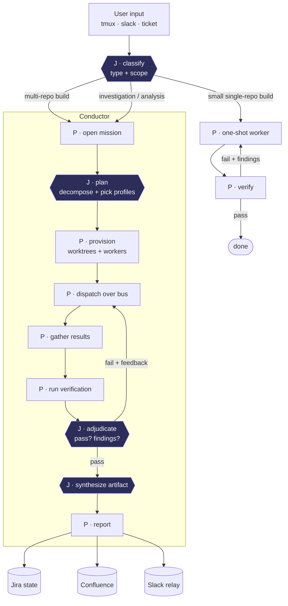

# Conductor — mission orchestrator (design draft)

The **Conductor** turns a *task* into a *verified result*. It's the hybrid from the
discussion: a **deterministic spine** (routing, provisioning, dispatch, state, I/O)
with a few **scoped judgment nodes** (Claude calls that emit structured output the
spine acts on). It sits on top of the nervous system already built (Slack bus,
mnemon, proxy/Langfuse) and the SDK runner (the worker node).

> Name is a placeholder — chosen to disambiguate from `slack-bridge/orchestrator.js`
> (which does bus presence/delivery, a different job).

## Design principles

1. **Narrow waist.** Constrain the *structure* (fixed pipeline stages, a finite
   profile library, output schemas); free the *judgment* (which profiles, how to
   split, is it correct). Smart where it matters, operable everywhere else.
2. **Judgment nodes emit structured output.** The spine never asks Claude "what
   next?" open-endedly — it asks a specific question with a typed answer.
3. **Verification is non-negotiable** — even the one-shot path verifies. A mission
   cannot report "done" until the verify stage passes.
4. **It's a loop, not a pipeline.** Failed verification feeds findings back into a
   re-dispatch, not a dead end.
5. **One-shot escape hatch.** Small single-repo work skips decomposition/fleet —
   just a worker + verify. Don't pay the coordination tax on trivial tasks.

## Flow



`J` = judgment (Claude, structured output). `P` = program (deterministic).

## Spine ↔ judgment contracts

| Node | Kind | In → Out |
|---|---|---|
| classify | J | task text → `ClassifyResult` |
| plan | J | goal + scope + profile library → `MissionPlan` |
| provision / dispatch / gather | P | plan → worker processes on the bus → `WorkerResult[]` |
| run verification | P | artifacts + `VerifySpec` → raw check output |
| adjudicate | J | check output → `VerifyVerdict` |
| synthesize | J | worker results + verdict → final artifact (PR body / Confluence doc) |
| report | P | artifact + verdict → Jira transition, Confluence publish, Slack relay |

## Node schemas

(TypeScript-ish for readability; each becomes a JSON Schema fed to the SDK's
structured-output / `can_use_tool` layer so the model is *forced* to return it.)

```ts
type ClassifyResult = {
  type: "building" | "investigation" | "analysis"
  goal: string                     // one-line mission statement
  repos: string[]                  // affected repos ([] for pure investigation)
  route: "one-shot" | "conductor"  // small single-repo build → one-shot; else conductor
  datasources: string[]            // ["snowflake","datadog","loki",...]
}

type MissionPlan = {
  strategy: string                 // 1–2 sentence rationale (auditable)
  subtasks: Subtask[]
  verify: VerifySpec               // how THIS mission proves it's done right
}
type Subtask = {
  id: string
  goal: string
  repo?: string
  profile: string                  // name from the profile library
  depends_on: string[]             // DAG → sequencing + handoff
}
type VerifySpec = {
  mode: "code" | "report"
  checks: string[]                 // code: ["tests","exercise","swarm-review"]
}                                  // report: ["fact-check","sourcing","reconcile"]

type WorkerResult = {
  subtask_id: string
  status: "done" | "blocked" | "error"
  summary: string
  artifacts: string[]              // paths, MR urls, doc ids
  handoff?: string                 // note to dependent subtasks
}

type VerifyVerdict = {
  pass: boolean
  findings: { severity: "blocker" | "major" | "minor"; where: string; what: string; fix_hint: string }[]
  recommendation: "ship" | "retry" | "escalate"
}
```

## Profile library — "the best group of tools/settings/agents"

A profile is a named bundle of model + effort + tools + MCP + permission policy +
verify spec. The `plan` node *selects and parameterizes* profiles; the spine
instantiates workers (SDK runner) from them. Crucially, a profile can just **be an
existing skill** — the planner's judgment becomes "which skill/profile, parameterized how."

```ts
type Profile = {
  name: string
  model: string                    // claude-opus-4-8 | claude-sonnet-5 | claude-haiku-4-5-...
  effort: "low" | "medium" | "high" | "xhigh"
  tools: string[]                  // allowed built-in tools
  mcp: string[]                    // ["agent-memory","snowflake",...]
  permission: "read-only" | "standard" | "autonomous"   // → can_use_tool policy
  skill?: string                   // optional: this profile runs a skill-mission
  verify: VerifySpec
}
```

| Profile | model / effort | tools + mcp | permission | skill | verify |
|---|---|---|---|---|---|
| `backend-build` | opus / high | Bash,Edit,Read,Grep,Glob + memory | standard | — | code: tests, exercise, swarm-review |
| `frontend-build` | opus / high | + dev-server exercise | standard | — | code: tests, exercise, swarm-review |
| `investigation` | opus / high | Read,Grep,Bash + snowflake,datadog,memory | read-only | `incident-postmortem` | report: fact-check, sourcing |
| `data-analysis` | sonnet / high | Read,Bash + snowflake | read-only | `member-provider-investigation` | report: sourcing, reconcile |
| `reviewer` | opus / high | Read,Grep,Bash | read-only | `swarm-review-mr` | (is the verify stage) |
| `techdebt` | opus / high | Bash,Edit,Read + memory | standard | `pull-techdebt` | code: tests, swarm-review |
| `one-shot` | sonnet / standard | Bash,Edit,Read,Grep,Glob + memory | standard | — | code: tests |

**Skills you already have that ARE missions/profiles:** `pull-techdebt` (building),
`incident-postmortem` / `member-provider-investigation` (investigation/analysis),
`swarm-review-mr` (the reviewer crew = the verify stage). The Conductor mostly
*routes to and sequences* these, adding decomposition (multi-repo) + the verify gate.

## Locked decisions (2026-07-09)

1. **Per-mission process**, resumable via the DB state store. Every mission is logged
   in the nexus DB (`agents.missions` / `mission_subtasks` / `mission_events`,
   migration `20260709000001`).
2. **Redundant state: local DB + Jira.** The DB is the source of truth (resumable +
   audit) and stitches to the knowledge graph via `memory_nodes.mission_id` /
   `memory_events.mission_id`; Jira mirrors it for standup / team surfacing.
3. **Effort/retry policy** (`config/conductor.yaml`): all `claude-opus-4-8`; the
   orchestrator's judgment nodes run at `max`; workers start at `high` and escalate to
   `xhigh` after 2 failed verify rounds; up to `max_replans: 5` verify→re-dispatch
   rounds before escalating to a human.
4. **Profile library = a config file** (`config/conductor.yaml`, symlinked to
   `~/.tmux/conductor.yaml`). Profiles are capability bundles; several point at an
   existing skill. Model/effort are global (`policy`), so profiles omit them.
5. **Dedicated reviewer fleet** runs the verify stage — `swarm-review-mr` spawned
   `policy.reviewer.count` (5) wide; distribute liberally.

## Built — roadmap complete (A–F + worktree isolation)
- **Schema** — migration `20260709000001` (missions/subtasks/events + knowledge-graph `mission_id`).
- **A/B** — `conductor_db.py` (state + event log) + `conductor.py` spine: classify/plan/adjudicate/
  synthesize judgment nodes (opus-4.8 @ max, structured JSON) + worker execution.
- **Worktree isolation** — workers run in a per-mission git worktree (branch `conductor/<mid8>`) or a
  scratch dir, never a live checkout; artifacts recorded as absolute paths so verify probes them.
- **C** — cross-process fleet dispatch (`conductor_worker.py`, one tmux window per subtask, DB gather)
  + `depends_on` DAG with upstream handoff + re-plan loop (`max_replans`, effort high→xhigh after 2 fails).
- **D** — verify = adversarial reviewer fleet (`reviewer.count` lens-diverse reviewers; majority-pass + no blockers).
- **E** — `report()`: commit the branch (always) + Jira/Confluence/MR (gated, **dry-run by default**) via `reporter_agent`.
- **F** — `conductor.py --resume <mid|prefix>` continues a non-terminal mission from persisted DB state.

**Run:** `conductor.py "<goal>"` (uses `config/conductor.yaml`: opus-4.8 @ max/high). Cheap smoke via
`CONDUCTOR_MODEL` / `CONDUCTOR_ORCH_EFFORT` / `CONDUCTOR_WORKER_EFFORT` / `CONDUCTOR_REVIEWERS`.
**Go live on reporting:** set `reporting.*.enabled` (+ a Confluence space) in the config.
**Optional hardening:** run reviewers over a real `git diff`; read-only Bash gate via a streaming worker.

## Personal-box bring-up (nexus / Linux)

The conductor was written on the work laptop; it runs on the personal box too (change
`conductor-personal-box`). What the box needs, and what's already handled:

- **Paths are host-agnostic.** `REPO` / `REPO_ROOT` in `conductor.py`, `conductor_db.py`,
  `runner.py`, `spike_mcp_probe.py` resolve `AGENTS_NEXUS_DIR` / `CONDUCTOR_REPO_ROOT`, else
  derive from the module location (`dirname(dirname(__file__))` = repo root; `dirname(REPO)` =
  sibling-repos root) — correct on both hosts, no env needed. (`AGENTS_NEXUS_DIR` is unset on
  the box, so a hardcoded fallback would break — the `__file__` derivation is deliberate.)
- **Venv** (gitignored): `uv venv agent-runner/.venv && uv pip install --python
  agent-runner/.venv/bin/python -r agent-runner/requirements.txt`. `uv` lives at
  `~/.local/bin/uv` (not on the minimal non-interactive PATH — use the full path in units).
- **Auth + observability come free** from the box's proxy: the conductor sets
  `ANTHROPIC_BASE_URL=http://localhost:4000/sess/<name>`, and `proxy/main.py` routes personal
  sessions straight to Anthropic (subscription OAuth) + Langfuse. Proven via
  `agent-runner/spike_proxy_test.py` (single haiku turn → `PROXY_OK`).
- **Config:** `config/conductor.personal.yaml` (the org reporting **off** — Jira/Confluence/MR;
  `state.jira: false`; only the `agent-memory` profiles —
  `backend-build`/`frontend-build`/`one-shot`; the box has neither snowflake/datadog MCP nor
  the work skills). Symlink `~/.tmux/conductor.yaml → config/conductor.personal.yaml` on this host.
- **Trello replaces Jira as the tracker here.** `reporting.trello.enabled` walks a mission's
  card through the board lifecycle: `minions-on-deck` (created) → `minions-in-progress` (running)
  → `Done` (success) / `Fucked` (escalated/failed), commenting the deliverable summary on the
  card at report time. Deterministic REST (no MCP/LLM) in `trello_open`/`trello_move`/
  `trello_comment`; the card id lives in `missions.jira_key`. Creds: `TRELLO_API_KEY`/
  `TRELLO_TOKEN` from env, else Doppler `infrastructure/prd` (board `EXAMPLE_BOARD`, Flippin Ballz).
  `--dry-run` logs the card actions instead of performing them.
- **Schema:** migration `20260709000001` applied to the box Postgres (the box does **not**
  use dbmate for `database/pgsql/migrations/` — apply the `-- migrate:up` section directly).
- **Always `--dry-run` on this host** — the box is GitHub and must never touch the org
  Jira/Confluence/GitLab. The worktree branch still commits locally (the deliverable).
- **Not ported:** auto-opening a GitHub PR (the `mr` path is GitLab/`glab`-shaped) — a
  GitHub-MR adapter is a separate change.

**Verified 2026-07-13:** `conductor.py --dry-run "…"` (haiku/low, 1 reviewer) ran the full
classify→plan→dispatch→verify→synthesize→report loop; reported→`['db','branch']`
(`mr_dryrun`/`jira_dryrun`/`confluence_dryrun` logged, nothing sent); ~30 MB RAM delta.
