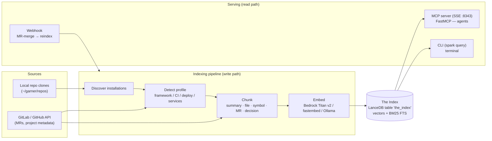
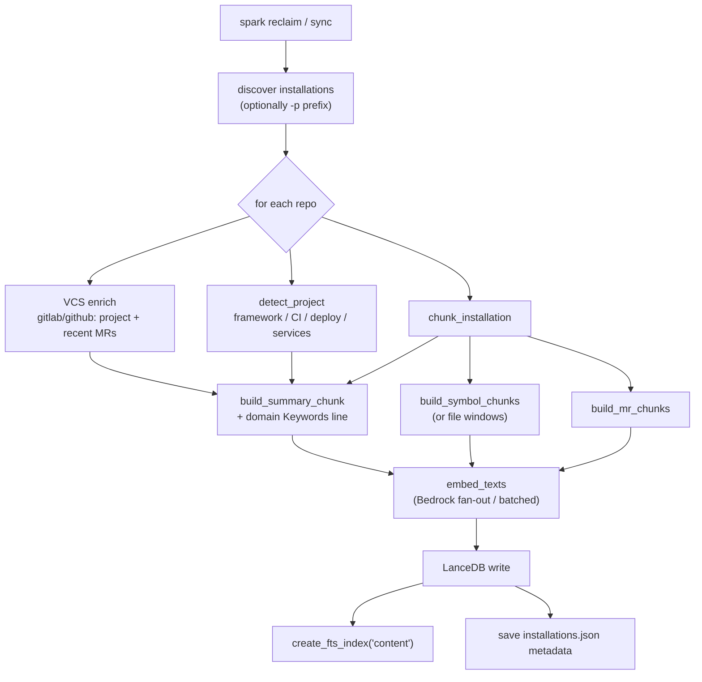
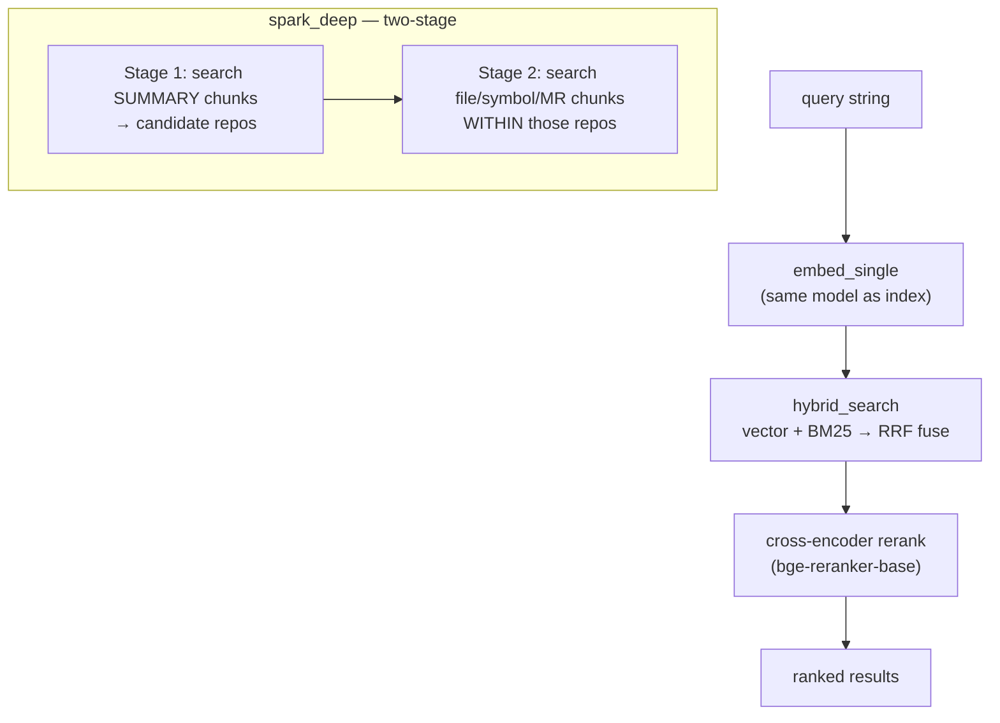

# Spark — Architecture

> *"I am the Monitor of this installation. I am 127 Guilty Spark."*

Spark ("343 Guilty Spark" / the **installation index**) is a semantic + lexical
search engine over a fleet of repositories. It indexes every repo in the Garner
monorepo-of-repos into a vector store and serves natural-language and structured
queries — *which repo does X?*, *where is the code for Y?*, *why was Z built this
way?* — to both terminal users (CLI) and AI agents (MCP).

This document is a high-level map. For exact behavior, the code is the source of
truth; file references are given as `path:line` where useful.

---

## 1. The big picture



Two halves:

- **Write path (indexing):** walk repos → enrich with VCS + detected metadata →
  break into chunks → embed → persist to LanceDB + build a full-text index.
- **Read path (serving):** a query is embedded and run through **hybrid retrieval
  (vector + BM25, RRF-fused)** then **cross-encoder rerank**, exposed via an MCP
  server and a CLI.

---

## 2. Components

| Component | File(s) | Responsibility |
|-----------|---------|----------------|
| **Config** | `config.py`, `config.yaml` | Typed `SparkConfig`; YAML + env overrides (`SPARK_*`, `AWS_*`). |
| **Discovery** | `indexer/builder.py` | Walk `installations_path`, resolve team from path prefix. |
| **Detector** | `detector.py` | Per-repo profile: language, framework, CI, deploy target, test/lint commands, service tags. Persisted to `installations.json`. |
| **VCS clients** | `gitlab.py`, `github.py` | Fetch project metadata + recent MRs/PRs to enrich summaries. |
| **Chunker** | `indexer/chunker.py` | Produce indexable `Chunk`s (see §3). |
| **Keyword extractor** | `indexer/keywords.py` | Pull in-code domain identifiers (enum/constant values) into summaries (see §6). |
| **Symbol parser** | `indexer/symbol_parser.py` | Tree-sitter AST symbols (functions/classes) instead of blind windows. |
| **Embedder** | `indexer/embedder.py` | Vendor-agnostic embeddings: **Bedrock Titan v2** (prod), `fastembed` (ONNX), or `litellm`/Ollama. |
| **Synthesizer** | `synthesizer.py` | LLM-generated *decision records* from merged MRs (the "why"). |
| **Builder** | `indexer/builder.py` | Orchestrates reclaim/sync; writes LanceDB + FTS index. |
| **Search** | `search.py` | Shared hybrid-search + rerank primitives (CLI and MCP behave identically). |
| **Reranker** | `indexer/reranker.py` | Cross-encoder (`bge-reranker-base`) precision reorder. |
| **Registry** | `registry.py` | Structured query over the per-repo manifest (`installations.json`). |
| **MCP server** | `server/mcp_server.py` | FastMCP tools over SSE; also hosts the GitLab webhook. |
| **CLI** | `cli.py` | `reclaim`, `sync`, `query`, registry/status commands. |
| **Webhook** | `webhook.py` | GitLab MR-merge → incremental reindex + decision synthesis. |

---

## 3. The Index — data model

A single LanceDB table, `the_index` (`builder.py:26`), holds heterogeneous
**chunks**, each an embedded vector + metadata. The `chunk_type` field is the
backbone of the two-stage search:

| `chunk_type` | One per… | Role |
|--------------|----------|------|
| `summary` | repo | **Monitor-log** — the coarse "what is this repo" doc. Drives **Stage-1 routing**. |
| `file` | sliding window | Raw file content (fallback when symbol chunking off). |
| `symbol` | function/class | AST-level code unit (tree-sitter). |
| `merge_request` | recent MR | Title/description/discussion of a merged change. |
| `decision` | synthesized MR | LLM "what changed / why / alternatives / impact" record. |

Each chunk also carries denormalized metadata for filtering and display: `team`,
`installation`, `installation_path`, `archived`, plus summary-only fields
(`description`, `topics`, `languages`, `framework`, `ci_type`, `deploy_target`,
`services`, `last_activity`).

Two retrieval indexes live over this table:
- **Vector index** — ANN over embeddings (1024-dim Titan v2 in prod).
- **Full-text (BM25) index** — built on `content` (`create_fts_index`), enabling
  exact-token / acronym matching that embeddings miss.

> **Vector-space invariant:** index-time and query-time embeddings must come from
> the same model + dimensions. Switching embedders requires a full `spark reclaim`.

---

## 4. Write path — indexing



**Two entry points** (`cli.py`, `builder.py`):

- **`spark reclaim [-p <prefix>]`** — full rebuild. Without a filter it overwrites
  the table in batches. With `-p` it does a **scoped, non-destructive partial
  rebuild**: embed the subset, `delete` only those repos' rows, `add` the new ones,
  then rebuild the FTS index. Used for schema migrations and content-logic changes.
- **`spark sync`** — incremental. Re-indexes only repos whose git HEAD changed since
  the last run (per `installations.json` metadata). Does **not** pick up indexing
  *logic* changes for unchanged repos — those need a `reclaim`.

The **webhook** (`webhook.py`) reindexes a single repo on GitLab MR-merge and
synthesizes a decision record, keeping the index fresh between full runs.

---

## 5. Read path — two-stage hybrid search



- **`spark`** — searches `summary` chunks only. Answers *"which repo handles X?"*.
- **`spark_deep`** — **Stage 1** finds candidate repos via summaries, **Stage 2**
  searches code/MR chunks *within* those repos. Answers *"where is the code for X?"*.

**Retrieval mechanics** (`search.py`):
1. **Hybrid** — vector ANN + BM25 FTS, fused with **Reciprocal Rank Fusion** (RRF).
   RRF scores are intentionally small (~`1/(60+rank)`); they rank, they're not
   similarity. Falls back to vector-only if FTS errors.
2. **Rerank** — a cross-encoder re-scores the top `fetch_k = top_k × multiplier`
   candidates for precision, and stamps a 0–1 `_relevance_score` for display.

> **Why summaries matter most:** Stage-1 routing runs entirely over `summary`
> chunks. If a term isn't in the summary, the right repo never enters the candidate
> set — no amount of Stage-2 power recovers it. This is why summary content quality
> (§6) is the highest-leverage lever for recall.

---

## 6. Summary enrichment (recall lever)

Prose READMEs/CLAUDE.md land in the summary, but **in-code domain vocabulary**
(data-source enums, status constants, event types) does not — so a query for a bare
domain term (e.g. *"which repo ingests POE"*) can fail to route, even though
`SOURCE_POE = "poe"` sits in the repo's `constants.py`.

`indexer/keywords.py` closes this gap. During summary construction it runs a bounded
AST scan of the repo's Python files and extracts two high-signal, low-noise families:

- module-level `UPPER_SNAKE` string constants (`SOURCE_POE = "poe"` → `poe`), and
- `Enum` member **values** (`class Source(str, Enum): POE = "poe"` → `poe`).

These are noise-filtered (types/protocols/arch/packaging tokens dropped), deduped,
ranked, and appended as a `Keywords:` line high in the summary — so **both** the
vector index and the BM25 index can match the bare term. Gated by
`summary_keywords_enabled` / `summary_keywords_max`.

```text
# svc-directory-ingestion
...
Services: aws, postgres, sql
Keywords: allan, gating_subject, ingestion_subject, modeling_subject, nppes, poe
## CLAUDE.md
...
```

Effect: a term like `allan` — previously present only in code and completely
unroutable — now resolves to exactly the repos that define it.

---

## 7. Interfaces

### MCP tools (`server/mcp_server.py`)
Served over **SSE** via FastMCP (default `:8343`). Consumed by AI agents.

| Tool | Purpose |
|------|---------|
| `spark` | Semantic/hybrid search over repo summaries — *which repo?* |
| `spark_deep` | Two-stage search down to file/symbol/MR — *where's the code?* |
| `list_installations` | Enumerate indexed repos (optional team filter). |
| `query_registry` | Structured filters (language / framework / CI / deploy / role). |
| `installation_summary` | Full monitor-log for one repo. |
| `recent_changes` | Recent indexed MRs for a repo. |
| `search_decisions` | Synthesized decision records — *why was X built this way?* |

### CLI (`cli.py`)
`spark reclaim`, `spark sync`, `spark query`, plus registry/status commands. Uses
the **same** `search.py` primitives as the MCP server, so terminal and agent results
are identical.

---

## 8. Deployment

```mermaid
flowchart LR
    subgraph host["Host (macOS / Linux)"]
        REPO["~/garner/repos"]
        IDX["~/.spark-index/&lt;index&gt;"]
        AWS["~/.aws (SSO creds)"]
        CFG["spark/config.yaml"]
        NIGHTLY["nightly job<br/>(launchd / systemd)"]
    end
    subgraph container["nexus-spark container"]
        SRV["spark serve --transport sse :8343"]
    end
    REPO -. bind /repos .-> SRV
    IDX  -. bind /app/data/the-index .-> SRV
    AWS  -. bind /root/.aws .-> SRV
    CFG  -. bind /app/config.yaml .-> SRV
    NIGHTLY --> IDX
    AGENTS["AI agents / Claude Code"] -->|MCP SSE| SRV
```

- Runs as the **`nexus-spark`** service in the agents-nexus Docker stack.
- **Bind mounts:** repos (`/repos`), the index (`/app/data/the-index`),
  `config.yaml`, and `~/.aws` (for Bedrock via `AWS_PROFILE`/SSO).
- The index is a **shared volume**: a host-side `reclaim` writes the same files the
  container reads. (Caveat: rebuilding the FTS index out from under a long-lived
  container connection requires a `docker restart nexus-spark` to refresh its handle.)
- A **nightly job** keeps the index current.

### Operational notes
- **Embeddings need credentials.** Bedrock requires a profile with
  `bedrock:InvokeModel` (SSO tokens expire — prefer a scoped IAM key for the
  long-running server).
- **Code vs. data.** The container runs **baked image code**; only `config.yaml` is
  mounted. Indexing-logic changes must be rebuilt into the image (or run on the host
  against the shared index, then restart the container).
- **Activation of indexing changes:** `reclaim` (not `sync`) — and a container
  restart if the FTS index was rebuilt under it.

---

## 9. Configuration highlights (`config.yaml`)

| Key | Meaning |
|-----|---------|
| `embedder` / `embedding_model` / `embedding_dimensions` | Embedding backend + vector space. |
| `hybrid_search_enabled` | Vector + BM25 RRF fusion (vs vector-only). |
| `reranker_enabled` / `reranker_model` | Cross-encoder precision reorder. |
| `symbol_chunking_enabled` | AST symbols vs sliding windows. |
| `summary_keywords_enabled` / `summary_keywords_max` | In-code domain-term enrichment (§6). |
| `spark_deep_stage1_k` | How many candidate repos Stage-1 surfaces. |
| `decisions_enabled` / `chat_model` | LLM decision-record synthesis. |
| `gitlab_*` / `github_*` | VCS enrichment + webhook. |
| `max_files_per_installation` / `max_file_size` | Indexing bounds for large repos. |
